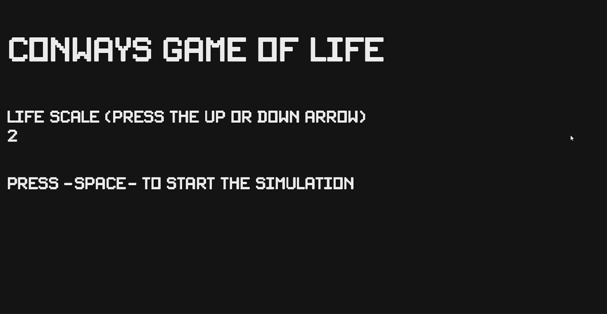

# Conway's Game of Life in C 

This project is a implementation of Conway's Game of Life in C. The Game of Life is a cellular automaton devised by the British mathematician John Horton Conway in 1970. It's a zero-player game, meaning that its evolution is determined by its initial state, requiring no further input. Despite its simplicity, the Game of Life is Turing complete and can simulate a universal constructor or any other Turing machine.

## Learning Objectives
- Understanding C semantics
- Implementing algorithms to simulate cellular automata
- memory management and dynamic data structures
- Understanding of the compilation and linking phases in C

## How the Game of life looks like

    

 

### The no player game

    

 

## If you want to try out the simulation 
- Download 
<a href="assets/readme/gameOfLife.zip" download>
   gameOfLife.zip
</a>
- Download, extract and run the main.exe file 
- This might throw out some warnings! 

## If you want to try this out!
To run the program, you'll need: 
- A C compiler
- SDL2 library and development files
- SDL2_ttf library and development files

